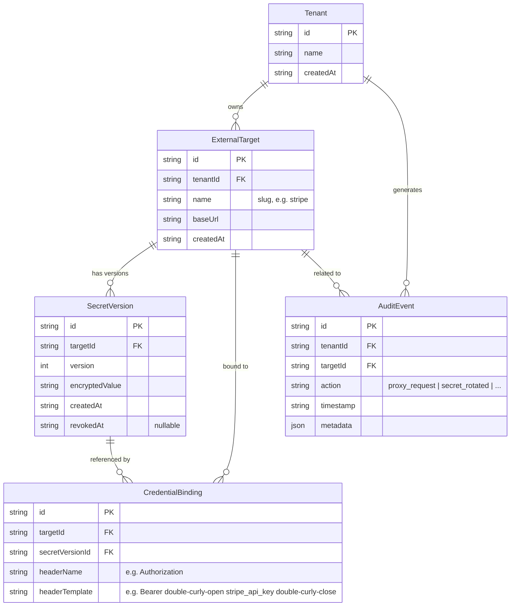

# Control-Plane Schema (ERD)

## Relationships

| From           | To                | Cardinality | Description                                                                |
| -------------- | ----------------- | ----------- | -------------------------------------------------------------------------- |
| Tenant         | ExternalTarget    | 1 → many    | A tenant registers multiple third-party APIs                               |
| ExternalTarget | SecretVersion     | 1 → many    | Each target can have multiple secret versions (for rotation)               |
| ExternalTarget | CredentialBinding | 1 → many    | Bindings define _how_ the secret is injected (which header, what template) |
| SecretVersion  | CredentialBinding | 1 → many    | A binding points to the active secret version                              |
| Tenant         | AuditEvent        | 1 → many    | Every proxy call and control-plane mutation is logged                      |
| ExternalTarget | AuditEvent        | 1 → many    | Audit events reference the target involved                                 |
